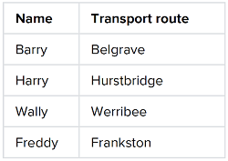

# API Integration Project for PTV / Slack

A simple integration project to send a once-off alert to a selected Slack user informing them the current status of their selected Metro line. 

This has been realised by:

* Writing a wrapper module for the PTV API and provide a basic set of methods. Accessible by including `ptv-api`
* Utilizing the third party gem `slack-ruby-client` that provides a comprehensive wrapper for the Slack Web API
* Both wrappers are encapsuled in the `IntegrationQuery` class to provide simple methods for realizing this project

A running version of the app can be found on [](https://damp-sea-30508.herokuapp.com/)

## Target

The targeted result was to make it possible creating following combination of Slack Users and Metro Lines for generating relevant alerts:

 

## API Credentials

To run the application your unique PTV and Slack API credentials need to be provided in the `secrets.yml` file. The development and production environment are configured to utilize the encoded file `secrets.yml.enc` which is enabled by `bin/rails secrets:setup`. 

API credentials to be added are: 

```
PTV_API_DEVID
PTV_API_KEY
SLACK_API_TOKEN 
```

The environment variables are being retreived with `Rails.application.secrets` within the app.

## Slack Notifications

User alert if no disruptions detected on selected Metro line.


User alert if more than one disruption has been detected on the selected Metro line.

  
